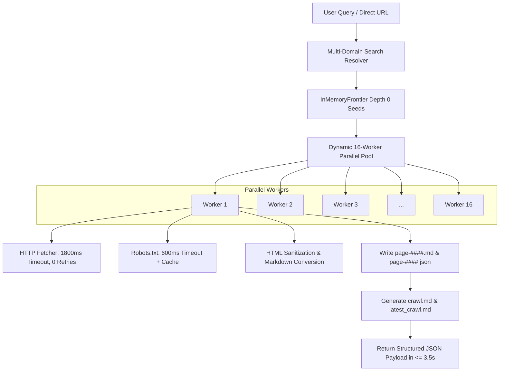

# Tavily Platform: API Specification & Team Contribution Guide

This guide provides technical specifications, JSON contracts, engine architecture, and development workflows to help engineering teams (Backend, Frontend, AI/Data, and DevOps) build and extend Tavily smoothly.

---

## 1. System Architecture Overview

Tavily is structured as a domain-driven monorepo managed with **pnpm** and **Turborepo**:

```text
tavily/
├── apps/
│   └── api/                  # Express REST orchestrator (port 4000)
├── domains/
│   ├── searching/            # Search provider integrations (SearXNG, Google, Bing, Organic)
│   ├── scraping/             # High-concurrency crawler, HTML extractor, markdown generator
│   ├── realtime/             # Event streams and websocket infrastructure
│   └── security/             # SSRF defense, anti-abuse, and rate limiting
├── packages/
│   ├── config/               # Shared environment validation
│   ├── errors/               # Central AppError hierarchy
│   └── logger/               # Structured JSON logger
└── storage/                  # Generated crawl storage (consolidated markdown archives)
    ├── latest_crawl.md       # Consolidated markdown containing all crawled pages
    └── crawls/
        └── <crawl_id>/       # Per-crawl archive (crawl.md, manifest.json)
```

---

## 2. API Reference (Pure JSON Contracts)

The backend operates as a **headless REST API**, returning standard `application/json` by default.

### Default Crawl & Benchmark Parameters:

- **`max_url` / `limit`:** Default **`5`** (Range: 1 – 500)
- **`max_depth` / `depth`:** Default **`5`** (Range: 1 – 50)
- **`multi_domain`:** Default **`true`** (Collects URLs across distinct internet domains)

---

### Endpoint 1: Search & Parallel Crawl

Executes multi-domain search resolution, parallel page crawling across 16 workers, markdown extraction, and persists files to disk.

- **Route:** `GET /?q=<query>&crawl=true`
- **Method:** `GET` or `POST`

#### Query Parameters:

| Parameter      | Type    | Default    | Description                                                  |
| :------------- | :------ | :--------- | :----------------------------------------------------------- |
| `q` or `query` | string  | _Required_ | Search query (e.g. `LLM`) or direct URL (`https://...`)      |
| `crawl`        | boolean | `true`     | Must be `true` to invoke crawler                             |
| `max_url`      | integer | `5`        | Maximum number of pages to crawl                             |
| `max_depth`    | integer | `5`        | Maximum BFS crawl depth                                      |
| `multi_domain` | boolean | `true`     | Allow cross-domain crawling from search seeds                |
| `format`       | string  | `json`     | Defaults to pure JSON (`html` optional for internal preview) |

#### Example Request:

```bash
curl -X GET "http://localhost:4000/?q=LLM&crawl=true&max_url=5&max_depth=5"
```

#### JSON Response Contract:

```json
{
  "success": true,
  "data": {
    "query": "LLM",
    "seedUrl": "https://www.geeksforgeeks.org/artificial-intelligence/large-language-model-llm/",
    "seedUrls": [
      "https://www.geeksforgeeks.org/artificial-intelligence/large-language-model-llm/",
      "https://www.techtarget.com/whatis/definition/large-language-model-LLM",
      "https://en.wikipedia.org/wiki/Large_language_model",
      "https://learn.microsoft.com/en-us/agent-framework/journey/llm-fundamentals",
      "https://developers.google.com/machine-learning/crash-course/llm"
    ],
    "totalSearchUrlsFound": 5,
    "multiDomain": true,
    "tookMs": 3400,
    "storageInfo": {
      "rootDir": "/workspace/storage",
      "crawlDir": "/workspace/storage/crawls/crawl_1791604178503_9e32a9e2",
      "manifestPath": "/workspace/storage/crawls/crawl_1791604178503_9e32a9e2/manifest.json",
      "combinedMarkdownPath": "/workspace/storage/crawls/crawl_1791604178503_9e32a9e2/crawl.md",
      "latestMarkdownPath": "/workspace/storage/latest_crawl.md",
      "files": ["latest_crawl.md", "crawl.md"]
    },
    "markdownFiles": {
      "combined": "/workspace/storage/crawls/crawl_1791604178503_9e32a9e2/crawl.md",
      "latest": "/workspace/storage/latest_crawl.md",
      "directory": "/workspace/storage/crawls/crawl_1791604178503_9e32a9e2",
      "pages": ["latest_crawl.md", "crawl.md"]
    },
    "crawl": {
      "success": true,
      "crawlId": "crawl_1791604178503_9e32a9e2",
      "stats": {
        "totalDiscovered": 56,
        "totalCrawled": 5,
        "totalFailed": 0,
        "totalSkipped": 0,
        "totalBytes": 585431,
        "durationMs": 3200
      },
      "pages": [
        {
          "url": "https://www.geeksforgeeks.org/artificial-intelligence/large-language-model-llm/",
          "normalizedUrl": "https://www.geeksforgeeks.org/artificial-intelligence/large-language-model-llm",
          "state": "COMPLETED",
          "depth": 0,
          "statusCode": 200,
          "metadata": {
            "title": "Introduction to Large Language Model (LLM) - GeeksforGeeks",
            "description": "A comprehensive guide to LLMs...",
            "contentHash": "e3b0c44298fc1c149afbf4c8996fb92427ae41e4649b934ca495991b7852b855",
            "byteSize": 142050,
            "isSpa": false,
            "usedPlaywright": false
          },
          "markdown": "# Introduction to Large Language Model (LLM)\n\nAn LLM is a type of artificial intelligence...",
          "outboundLinks": [
            "https://www.geeksforgeeks.org/deep-learning/",
            "https://www.geeksforgeeks.org/machine-learning/"
          ],
          "tookMs": 460,
          "timestamp": "2026-10-10T03:52:45.000Z"
        }
      ]
    }
  }
}
```

---

### Endpoint 2: Performance Benchmark Matrix

Tests crawling performance and metrics across single combinations or matrices.

- **Route:** `GET /benchmark`
- **Method:** `GET` or `POST`

#### Query Parameters:

| Parameter      | Type    | Default          | Description                                    |
| :------------- | :------ | :--------------- | :--------------------------------------------- |
| `q` or `url`   | string  | _Required_       | Search query or seed URL                       |
| `max_url`      | integer | `5`              | URLs per test when testing single combination  |
| `max_depth`    | integer | `5`              | Depth per test when testing single combination |
| `combinations` | string  | `5:5,10:5,15:10` | Comma-separated pairs `max_url:max_depth`      |

#### Example Single Combination:

```bash
curl "http://localhost:4000/benchmark?q=deep+learning&max_url=5&max_depth=5"
```

#### Example Matrix Combination:

```bash
curl "http://localhost:4000/benchmark?q=deep+learning&combinations=5:5,10:5,15:10"
```

#### JSON Response Contract:

```json
{
  "success": true,
  "data": {
    "query": "deep learning",
    "targetUrls": [
      "https://www.geeksforgeeks.org/deep-learning/",
      "https://www.ibm.com/think/topics/deep-learning",
      "https://en.wikipedia.org/wiki/Deep_learning"
    ],
    "results": [
      {
        "maxUrl": 5,
        "maxDepth": 5,
        "durationMs": 1820,
        "totalCrawled": 5,
        "totalDiscovered": 84,
        "totalBytes": 420100,
        "avgDurationPerPageMs": 364
      },
      {
        "maxUrl": 10,
        "maxDepth": 5,
        "durationMs": 3410,
        "totalCrawled": 10,
        "totalDiscovered": 192,
        "totalBytes": 890400,
        "avgDurationPerPageMs": 341
      }
    ]
  }
}
```

---

### Endpoint 3: Direct Markdown File Access

Files written by the crawler are statically exposed via HTTP:

1. **Latest Consolidated Markdown (Plain text):**
   ```text
   GET http://localhost:4000/latest_crawl.md
   Content-Type: text/markdown; charset=utf-8
   ```
2. **Specific Crawl Combined Markdown:**
   ```text
   GET http://localhost:4000/storage/crawls/<crawl_id>/crawl.md
   ```
3. **Specific Page Markdown (with YAML frontmatter):**
   ```text
   GET http://localhost:4000/storage/crawls/<crawl_id>/page-0001.md
   ```

---

## 3. Crawler Engine Architecture & Performance Optimizations

To keep crawl duration **consistently under 3.5 – 4.0 seconds** for batches of 5 to 10 pages, the engine incorporates four performance guardrails:



1. **Active Worker Pool (`concurrency = 16`):**
   Rather than sequential iteration, workers run concurrently via `Promise.all(workers)`. Each worker pulls from the frontier, processes network fetching, extracts content, and writes to storage in parallel.
2. **Strict Timeouts (1,800ms):**
   Slow or unresponsive websites abort after 1.8s with 0 retries. This ensures a slow external server never stalls the crawl pipeline.
3. **Optimized Robots.txt Resolution (600ms):**
   Robots.txt checks time out in 600ms with permissive fallback and origin caching.
4. **Gated Sitemap Parsing:**
   Large XML sitemaps are skipped on multi-domain and search crawls, preventing 2–3s network stalls.

---

## 4. Frontend Integration Guide

Frontend developers can consume the API easily without any custom HTML parsing.

### Example React / Next.js Fetch Hook:

```typescript
interface CrawlResponse {
  success: boolean;
  data: {
    query: string;
    tookMs: number;
    markdownFiles: {
      combined: string;
      latest: string;
    };
    crawl: {
      stats: {
        totalCrawled: number;
        totalBytes: number;
      };
      pages: Array<{
        url: string;
        title: string;
        markdown: string;
        statusCode: number;
        tookMs: number;
      }>;
    };
  };
}

export async function runCrawl(query: string, maxUrl = 5, maxDepth = 5): Promise<CrawlResponse> {
  const url = new URL("http://localhost:4000/");
  url.searchParams.set("q", query);
  url.searchParams.set("crawl", "true");
  url.searchParams.set("max_url", String(maxUrl));
  url.searchParams.set("max_depth", String(maxDepth));

  const res = await fetch(url.toString(), {
    headers: { Accept: "application/json" },
  });

  if (!res.ok) {
    throw new Error(`Crawl failed: ${res.statusText}`);
  }

  return res.json();
}
```

---

## 5. Development & Contribution Commands

### Install & Build

```bash
# Install all monorepo dependencies
pnpm install

# Build all packages & domains
pnpm build

# Run API in development watch mode
pnpm --filter @tavily/api dev
```

### Running Test Suites

```bash
# Run all unit and integration tests across monorepo
pnpm test

# Run individual domain tests
pnpm --filter @tavily/scraping test
pnpm --filter @tavily/searching test
pnpm --filter @tavily/api test
```

### Code Quality & Standards

```bash
# TypeScript type checking
pnpm typecheck

# ESLint verification
pnpm lint

# Prettier code formatting
pnpm format
```
