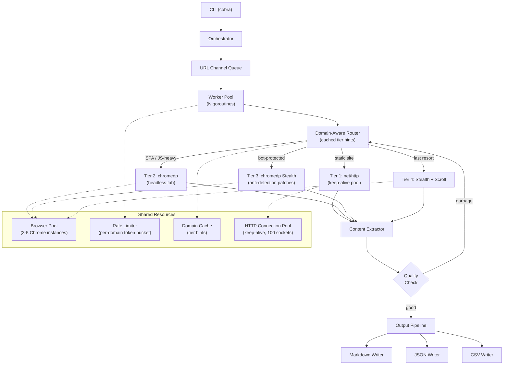
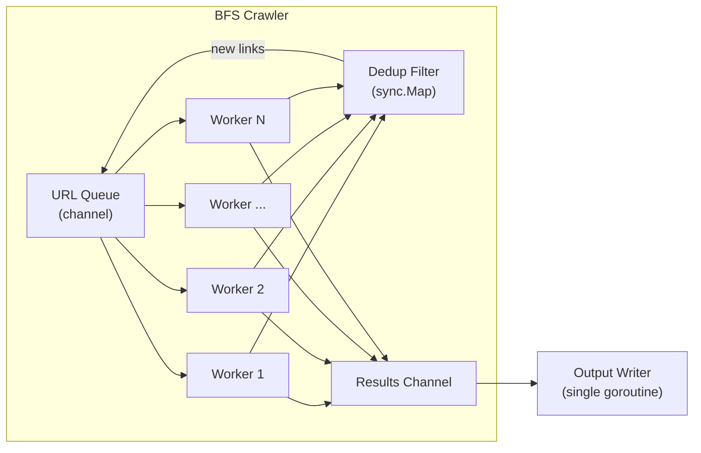

# 🚀 Go Scraper Architecture — Firecrawl-Speed Rebuild

> **Goal**: Rebuild the Universal Web Scraper in Go to achieve Firecrawl-level speed.  
> Go gives us: goroutines (1000s of concurrent workers), zero-cost concurrency, connection pooling built into `net/http`, and raw HTML parsing 10-50x faster than Node.js.

---

## Why Go Over TypeScript for This

| Dimension | TypeScript (current) | Go (target) |
|-----------|---------------------|-------------|
| Concurrency model | `p-limit(5)`, single-threaded event loop | Goroutines — schedule 10,000+ lightweight tasks |
| HTTP client | Axios, new TCP conn per request | `net/http` with built-in connection pool & keep-alive |
| Browser overhead | Launch Chromium per request (~1s each) | `chromedp` with persistent browser pool (reuse tabs) |
| HTML parsing | Cheerio/JSDOM (JS overhead) | `goquery` (native speed, ~10-50x faster) |
| Memory | Node.js ~100MB per Playwright instance | Go binary ~15MB, chromedp tab ~30MB |
| Build output | Needs Node.js + npm + tsx runtime | Single static binary, zero dependencies |

---

## High-Level Architecture



---

## Project Structure

```
go-scraper/
├── cmd/
│   └── scraper/
│       └── main.go                 # Entry point + CLI (cobra)
│
├── internal/
│   ├── config/
│   │   └── config.go               # Configuration struct + defaults + env parsing
│   │
│   ├── orchestrator/
│   │   └── orchestrator.go         # Manages modes: scrape, crawl, sitemap, discover
│   │
│   ├── worker/
│   │   └── pool.go                 # Goroutine worker pool with channel-based queue
│   │
│   ├── fetch/
│   │   ├── http.go                 # Tier 1: net/http with keep-alive pool
│   │   ├── browser.go              # Tier 2: chromedp headless (standard)
│   │   ├── stealth.go              # Tier 3: chromedp with anti-detection patches
│   │   ├── pipeline.go             # Progressive tier escalation logic
│   │   └── browser_pool.go         # Shared Chrome instance pool
│   │
│   ├── extract/
│   │   ├── readability.go          # go-readability article extraction
│   │   ├── goquery.go              # goquery fallback extraction
│   │   ├── content.go              # Combined extractor (dual-engine like current)
│   │   ├── jsonld.go               # JSON-LD structured data extraction
│   │   ├── metadata.go             # <head> metadata extraction
│   │   └── links.go                # Link discovery + normalization
│   │
│   ├── detect/
│   │   ├── site_type.go            # SPA / static / infinite-scroll detection
│   │   ├── bot_protection.go       # Cloudflare / Akamai / DataDome detection
│   │   └── quality.go              # hasRealContent — smart content validation
│   │
│   ├── convert/
│   │   ├── markdown.go             # HTML → Markdown (html-to-markdown lib)
│   │   └── url_rewrite.go          # Smart URL rewriting (Reddit JSON, Nitter, etc.)
│   │
│   ├── crawl/
│   │   ├── bfs.go                  # BFS crawler with concurrent page processing
│   │   ├── robots.go               # robots.txt parser + compliance
│   │   └── sitemap.go              # Sitemap XML discovery + parsing
│   │
│   ├── ratelimit/
│   │   ├── limiter.go              # Per-domain token bucket rate limiter
│   │   └── proxy.go                # Proxy rotation with failure tracking
│   │
│   ├── output/
│   │   ├── writer.go               # Output dispatcher (picks format)
│   │   ├── markdown.go             # .md file writer
│   │   ├── json.go                 # .json file writer
│   │   ├── csv.go                  # .csv batch writer
│   │   └── summary.go              # Summary report generator
│   │
│   └── types/
│       └── types.go                # All shared types: ScrapeResult, Config, etc.
│
├── go.mod
├── go.sum
├── Makefile                        # Build, test, lint targets
└── README.md
```

---

## Core Components — Detailed Design

### 1. Worker Pool (`internal/worker/pool.go`)

> **This is the #1 speed win over TypeScript.**  
> Instead of `p-limit(5)` on a single thread, we run N goroutines pulling from a channel.

```go
package worker

import "sync"

// Job represents a single URL to scrape
type Job struct {
    URL   string
    Depth int // for crawling
}

// Result wraps the scrape outcome
type Result struct {
    Job    Job
    Output types.ScrapeResult
    Links  []string // discovered links (for crawler)
}

// Pool runs N concurrent workers pulling jobs from a channel
type Pool struct {
    workers    int
    jobCh      chan Job
    resultCh   chan Result
    wg         sync.WaitGroup
    processFn  func(Job) Result
}

func New(workers int, processFn func(Job) Result) *Pool {
    return &Pool{
        workers:   workers,
        jobCh:     make(chan Job, workers*10), // buffered for throughput
        resultCh:  make(chan Result, workers*10),
        processFn: processFn,
    }
}

func (p *Pool) Start() {
    for i := 0; i < p.workers; i++ {
        p.wg.Add(1)
        go func() {
            defer p.wg.Done()
            for job := range p.jobCh {
                p.resultCh <- p.processFn(job)
            }
        }()
    }
}

func (p *Pool) Submit(job Job) { p.jobCh <- job }
func (p *Pool) Results() <-chan Result { return p.resultCh }

func (p *Pool) Close() {
    close(p.jobCh)
    p.wg.Wait()
    close(p.resultCh)
}
```

**Why this is fast**: Goroutines are ~2KB each (vs ~1MB per OS thread). You can run 500 concurrent HTTP scrapers on a laptop. The channel acts as a natural backpressure mechanism.

---

### 2. HTTP Fetcher with Connection Pool (`internal/fetch/http.go`)

> **Fixes TypeScript flaw: no connection reuse.**  
> Go's `net/http` has built-in keep-alive pooling — we just configure it properly.

```go
package fetch

import (
    "context"
    "io"
    "net"
    "net/http"
    "time"
)

var httpClient = &http.Client{
    Timeout: 15 * time.Second,
    Transport: &http.Transport{
        // CONNECTION POOL — the key to speed
        MaxIdleConns:        200,
        MaxIdleConnsPerHost: 50,
        MaxConnsPerHost:     50,
        IdleConnTimeout:     90 * time.Second,

        // Fast DNS + TCP
        DialContext: (&net.Dialer{
            Timeout:   5 * time.Second,
            KeepAlive: 30 * time.Second,
        }).DialContext,

        // TLS handshake timeout
        TLSHandshakeTimeout:   5 * time.Second,
        ResponseHeaderTimeout: 10 * time.Second,

        // Enable HTTP/2 (multiplexed requests over one TCP conn)
        ForceAttemptHTTP2: true,

        // Compression
        DisableCompression: false,
    },
    // Follow redirects (up to 10)
    CheckRedirect: func(req *http.Request, via []*http.Request) error {
        if len(via) >= 10 {
            return http.ErrUseLastResponse
        }
        return nil
    },
}

// USER_AGENTS — rotated per request
var userAgents = []string{
    "Mozilla/5.0 (Windows NT 10.0; Win64; x64) AppleWebKit/537.36 ...",
    "Mozilla/5.0 (Macintosh; Intel Mac OS X 10_15_7) ...",
    // ... 8+ agents
}

func FetchHTTP(ctx context.Context, url string) (*FetchResult, error) {
    req, _ := http.NewRequestWithContext(ctx, "GET", url, nil)

    // Realistic browser headers
    req.Header.Set("User-Agent", rotateUA())
    req.Header.Set("Accept", "text/html,application/xhtml+xml,...")
    req.Header.Set("Accept-Language", "en-US,en;q=0.9")
    req.Header.Set("Accept-Encoding", "gzip, deflate, br")
    req.Header.Set("Sec-Fetch-Dest", "document")
    req.Header.Set("Sec-Fetch-Mode", "navigate")

    start := time.Now()
    resp, err := httpClient.Do(req)
    if err != nil {
        return nil, err
    }
    defer resp.Body.Close()

    body, _ := io.ReadAll(resp.Body)
    return &FetchResult{
        HTML:     string(body),
        Method:   "http",
        FetchMs:  time.Since(start).Milliseconds(),
        Status:   resp.StatusCode,
    }, nil
}
```

**Why this is fast**: A single `http.Client` reuses TCP connections across ALL requests to the same host. For crawling one domain, after the first request, every subsequent request skips DNS + TCP + TLS handshake (~200-400ms saved per request).

---

### 3. Browser Pool with chromedp (`internal/fetch/browser_pool.go`)

> **Fixes TypeScript flaw: browser launch per request.**  
> `chromedp` uses Chrome DevTools Protocol directly — no Playwright wrapper overhead.

```go
package fetch

import (
    "context"
    "sync"

    "github.com/chromedp/chromedp"
)

// BrowserPool manages N Chrome instances, each handling multiple tabs
type BrowserPool struct {
    mu        sync.Mutex
    contexts  []context.Context    // allocator contexts (one per Chrome)
    cancels   []context.CancelFunc
    idx       int
    poolSize  int
}

func NewBrowserPool(size int) *BrowserPool {
    pool := &BrowserPool{poolSize: size}
    pool.init()
    return pool
}

func (bp *BrowserPool) init() {
    opts := append(chromedp.DefaultExecAllocatorOptions[:],
        chromedp.Flag("headless", true),
        chromedp.Flag("disable-gpu", true),
        chromedp.Flag("no-sandbox", true),
        chromedp.Flag("disable-blink-features", "AutomationControlled"),
        chromedp.Flag("disable-features", "IsolateOrigins,site-per-process"),
        chromedp.WindowSize(1920, 1080),
    )

    for i := 0; i < bp.poolSize; i++ {
        allocCtx, cancel := chromedp.NewExecAllocator(context.Background(), opts...)
        // Create a persistent browser context
        browserCtx, _ := chromedp.NewContext(allocCtx)
        // Force browser launch by running a dummy action
        chromedp.Run(browserCtx)

        bp.contexts = append(bp.contexts, browserCtx)
        bp.cancels = append(bp.cancels, cancel)
    }
}

// Acquire returns a browser context to create a new tab in
func (bp *BrowserPool) Acquire() context.Context {
    bp.mu.Lock()
    defer bp.mu.Unlock()
    ctx := bp.contexts[bp.idx % bp.poolSize]
    bp.idx++
    return ctx
}

// NewTab creates a new tab in an existing browser
func (bp *BrowserPool) NewTab(parentCtx context.Context) (context.Context, context.CancelFunc) {
    return chromedp.NewContext(parentCtx) // ~5ms vs ~1000ms for new browser
}

func (bp *BrowserPool) Shutdown() {
    for _, cancel := range bp.cancels {
        cancel()
    }
}
```

**Speed comparison**:
| Operation | TypeScript (current) | Go (this design) |
|-----------|---------------------|-------------------|
| New browser | ~1000ms | Done once at startup |
| New page/tab | N/A (launches browser) | ~5ms |
| Concurrent tabs | 1 per browser | 10-20 per browser |

---

### 4. Domain-Aware Router (`internal/fetch/pipeline.go`)

> **Fixes TypeScript flaw: sequential tier escalation + no learning.**  
> After the first URL from a domain, we KNOW which tier works — skip the rest.

```go
package fetch

import (
    "sync"
)

// domainCache remembers which fetch tier works for each domain
type domainCache struct {
    mu    sync.RWMutex
    hints map[string]string // domain → "http" | "browser" | "stealth"
}

var cache = &domainCache{hints: make(map[string]string)}

func (dc *domainCache) Get(domain string) string {
    dc.mu.RLock()
    defer dc.mu.RUnlock()
    return dc.hints[domain]
}

func (dc *domainCache) Set(domain, method string) {
    dc.mu.Lock()
    defer dc.mu.Unlock()
    dc.hints[domain] = method
}

// FetchWithEscalation — the core pipeline
func FetchWithEscalation(url string, pool *BrowserPool, cfg *Config) *ScrapeResult {
    domain := extractDomain(url)
    hint := cache.Get(domain)

    // FAST PATH: if we already know what works for this domain, go direct
    switch hint {
    case "http":
        result := tryHTTP(url, cfg)
        if result != nil { return result }
    case "browser":
        result := tryBrowser(url, pool, cfg)
        if result != nil { return result }
    case "stealth":
        result := tryStealth(url, pool, cfg)
        if result != nil { return result }
    }

    // SLOW PATH: first time seeing this domain — progressive escalation
    // Tier 1: Fast HTTP
    if result := tryHTTP(url, cfg); result != nil {
        cache.Set(domain, "http")
        return result
    }

    // Tier 2: Standard browser
    if result := tryBrowser(url, pool, cfg); result != nil {
        cache.Set(domain, "browser")
        return result
    }

    // Tier 3: Stealth browser
    if result := tryStealth(url, pool, cfg); result != nil {
        cache.Set(domain, "stealth")
        return result
    }

    // Tier 4: Stealth + aggressive scroll
    if result := tryStealthScroll(url, pool, cfg); result != nil {
        cache.Set(domain, "stealth")
        return result
    }

    return &ScrapeResult{URL: url, Success: false, Error: "all tiers exhausted"}
}
```

**Impact**: When crawling `docs.python.org` (50 pages), instead of trying Axios on ALL 50 pages, it tries Axios on page 1, learns it works, then goes direct for pages 2-50. Saves **~49 unnecessary escalation attempts**.

---

### 5. Smart Content Readiness (`internal/detect/quality.go`)

> **Fixes TypeScript flaw: blind `waitForTimeout(3000-6000ms)`.**  
> Poll for content instead of sleeping.

```go
// WaitForContent polls the page until real content appears or timeout
func WaitForContent(ctx context.Context, minChars int, maxWait time.Duration) error {
    deadline := time.Now().Add(maxWait)
    for time.Now().Before(deadline) {
        var textLen int
        err := chromedp.Evaluate(`
            document.body?.innerText?.replace(/\s+/g, " ").trim().length || 0
        `, &textLen).Do(ctx)

        if err == nil && textLen > minChars {
            return nil // Content is ready!
        }
        time.Sleep(200 * time.Millisecond) // Poll every 200ms
    }
    return fmt.Errorf("timeout: content not ready after %v", maxWait)
}
```

**Impact**: Static sites return in 200ms instead of waiting the full 3000ms. SPAs return as soon as they hydrate (~500-800ms) instead of the hardcoded 4000ms.

---

### 6. Rate Limiter with Token Bucket (`internal/ratelimit/limiter.go`)

```go
package ratelimit

import (
    "sync"
    "time"

    "golang.org/x/time/rate"
)

// PerDomainLimiter creates a separate rate limiter per domain
type PerDomainLimiter struct {
    mu       sync.Mutex
    limiters map[string]*rate.Limiter
    rps      float64 // requests per second per domain
    burst    int
}

func New(requestsPerSecond float64, burst int) *PerDomainLimiter {
    return &PerDomainLimiter{
        limiters: make(map[string]*rate.Limiter),
        rps:      requestsPerSecond,
        burst:    burst,
    }
}

func (l *PerDomainLimiter) Wait(domain string) {
    l.mu.Lock()
    limiter, ok := l.limiters[domain]
    if !ok {
        limiter = rate.NewLimiter(rate.Limit(l.rps), l.burst)
        l.limiters[domain] = limiter
    }
    l.mu.Unlock()

    limiter.Wait(context.Background())
}
```

**Why better than current**: Uses Go's standard `golang.org/x/time/rate` token bucket — mathematically correct, no timestamp array overhead, and auto-handles burst capacity.

---

## BFS Crawler Design (`internal/crawl/bfs.go`)



```go
func Crawl(startURL string, cfg CrawlConfig) []types.ScrapeResult {
    visited := &sync.Map{}
    results := make(chan types.ScrapeResult, 100)
    queue := make(chan Job, 1000)
    var wg sync.WaitGroup

    // Seed the queue
    queue <- Job{URL: startURL, Depth: 0}
    visited.Store(startURL, true)
    activeJobs := int64(1)

    // Start N workers
    for i := 0; i < cfg.Concurrency; i++ {
        wg.Add(1)
        go func() {
            defer wg.Done()
            for job := range queue {
                result := FetchWithEscalation(job.URL, browserPool, &cfg.Pipeline)
                results <- result.Output

                // Enqueue discovered links
                if job.Depth < cfg.MaxDepth {
                    for _, link := range result.Links {
                        if _, seen := visited.LoadOrStore(link, true); !seen {
                            if atomic.AddInt64(&activeJobs, 1) <= int64(cfg.MaxPages) {
                                queue <- Job{URL: link, Depth: job.Depth + 1}
                            }
                        }
                    }
                }

                if atomic.AddInt64(&activeJobs, -1) == 0 {
                    close(queue) // All work done
                }
            }
        }()
    }

    // Collect results
    go func() { wg.Wait(); close(results) }()

    var allResults []types.ScrapeResult
    for r := range results {
        allResults = append(allResults, r)
    }
    return allResults
}
```

---

## Key Go Libraries

| Purpose | Library | Why |
|---------|---------|-----|
| HTTP client | `net/http` (stdlib) | Built-in connection pool, HTTP/2, zero deps |
| HTML parsing | [`goquery`](https://github.com/PuerkitoBio/goquery) | jQuery-like API, 10-50x faster than Cheerio |
| Readability | [`go-readability`](https://github.com/go-shiori/go-readability) | Mozilla Readability port for Go |
| HTML→Markdown | [`html-to-markdown`](https://github.com/JohannesKaufmann/html-to-markdown) | Turndown equivalent for Go |
| Browser automation | [`chromedp`](https://github.com/chromedp/chromedp) | Direct CDP, no wrapper overhead |
| CLI framework | [`cobra`](https://github.com/spf13/cobra) | Industry standard Go CLI |
| Rate limiting | [`golang.org/x/time/rate`](https://pkg.go.dev/golang.org/x/time/rate) | Token bucket, stdlib quality |
| Robots.txt | [`robotstxt`](https://github.com/temoto/robotstxt) | Full robots.txt parser |
| Sitemap parsing | `encoding/xml` (stdlib) | Native XML parsing |
| Logging | [`slog`](https://pkg.go.dev/log/slog) (stdlib) | Structured logging, Go 1.21+ |

---

## Build Phases

### Phase 1 — Core Engine (Week 1)
> Get single-URL scraping working faster than the TypeScript version.

```
✅ cmd/scraper/main.go          — CLI with "scrape" command
✅ internal/config/config.go     — Config struct + defaults
✅ internal/fetch/http.go        — Tier 1: net/http with pool
✅ internal/detect/quality.go    — hasRealContent port
✅ internal/extract/content.go   — Readability + goquery dual engine
✅ internal/convert/markdown.go  — HTML → Markdown
✅ internal/output/writer.go     — JSON + Markdown file output
✅ internal/types/types.go       — Shared types
```

**Milestone**: `go-scraper scrape https://example.com` → output in <500ms.

### Phase 2 — Browser Tiers (Week 2)
> Add chromedp browser rendering with pool for SPA/protected sites.

```
✅ internal/fetch/browser_pool.go  — Shared Chrome pool
✅ internal/fetch/browser.go       — Tier 2: standard headless
✅ internal/fetch/stealth.go       — Tier 3: anti-detection patches
✅ internal/fetch/pipeline.go      — Progressive escalation + domain cache
✅ internal/detect/site_type.go    — SPA / static detection
✅ internal/detect/bot_protection.go — WAF detection
✅ internal/convert/url_rewrite.go — Reddit/Twitter/Medium rewrites
```

**Milestone**: `go-scraper scrape https://spa-site.com` → auto-escalates to browser, succeeds.

### Phase 3 — Crawler (Week 3)
> Full BFS crawler with concurrent workers, robots.txt, sitemap discovery.

```
✅ internal/worker/pool.go        — Generic goroutine worker pool
✅ internal/crawl/bfs.go          — BFS crawler
✅ internal/crawl/robots.go       — robots.txt parser
✅ internal/crawl/sitemap.go      — Sitemap XML parser
✅ internal/ratelimit/limiter.go  — Per-domain token bucket
✅ internal/ratelimit/proxy.go    — Proxy rotation
✅ internal/extract/links.go      — Link discovery
✅ CLI: "crawl", "sitemap", "discover" commands
```

**Milestone**: `go-scraper crawl https://docs.python.org --depth=2 --pages=50` → 50 pages in <30s.

### Phase 4 — Polish & Performance (Week 4)
> Optimization pass, benchmarks, production hardening.

```
✅ Benchmark suite (go test -bench)
✅ Graceful shutdown (OS signal handling)
✅ Structured logging with slog
✅ Error retry with exponential backoff
✅ CSV batch output
✅ Summary report generator
✅ Makefile (build, test, lint, release)
✅ README with usage examples
```

---

## Expected Performance (TypeScript → Go)

| Metric | TypeScript (current) | Go (target) | Speedup |
|--------|---------------------|-------------|---------|
| **Single page (static)** | ~2-5s | ~200-500ms | **5-10x** |
| **Single page (SPA)** | ~5-15s | ~1-3s | **5x** |
| **50-page crawl (static)** | ~60-120s | ~5-10s | **10-20x** |
| **50-page crawl (SPA)** | ~300-600s | ~30-60s | **10x** |
| **Max concurrency** | 5 (p-limit) | 100-500 (goroutines) | **20-100x** |
| **Memory per page** | ~100MB (Playwright) | ~30MB (chromedp tab) | **3x** |
| **Binary size** | ~500MB (node_modules) | ~15MB (static binary) | **33x** |
| **Startup time** | ~2s (tsx boot) | ~10ms | **200x** |

---

## Architecture Decisions Summary

| Decision | Choice | Rationale |
|----------|--------|-----------|
| Browser lib | `chromedp` over `rod` | Direct CDP, no wrapper; better pool control |
| HTTP client | stdlib `net/http` | Built-in pool, HTTP/2, zero deps |
| Concurrency | goroutines + channels | Native to Go, zero overhead |
| URL queue | buffered channel | Natural backpressure, no external deps (Redis later if distributed) |
| Domain caching | `sync.Map` | Lock-free reads, safe concurrent writes |
| Rate limiter | `x/time/rate` token bucket | Mathematically correct, handles bursts |
| CLI | `cobra` | Standard, supports subcommands |
| Output | File-per-page + batch CSV | Matches current TypeScript behavior |

---

## Anti-Bot Strategy (Preserved from TypeScript)

All the stealth techniques from your current [fetcher.ts](file:///c:/Users/Sujal%20Jaiswal/OneDrive/Desktop/scraper/src/fetcher.ts) carry over to chromedp:

```go
// Stealth patches via chromedp — same as your Playwright stealth init scripts
chromedp.Evaluate(`
    // Hide webdriver
    Object.defineProperty(navigator, 'webdriver', {get: () => undefined});
    
    // Fake plugins
    Object.defineProperty(navigator, 'plugins', {
        get: () => [{name:'Chrome PDF Plugin'},{name:'Chrome PDF Viewer'},{name:'Native Client'}]
    });
    
    // Fake WebGL renderer (hide SwiftShader)
    const getParam = WebGLRenderingContext.prototype.getParameter;
    WebGLRenderingContext.prototype.getParameter = function(p) {
        if (p === 37445) return 'Intel Inc.';
        if (p === 37446) return 'Intel Iris OpenGL Engine';
        return getParam.call(this, p);
    };
`)
```

---

> [!IMPORTANT]
> **Start with Phase 1.** Get `go-scraper scrape <url>` working with just HTTP fetching + goquery extraction. This alone will be faster than your entire current TypeScript pipeline for static sites. Then layer on the browser tiers.
